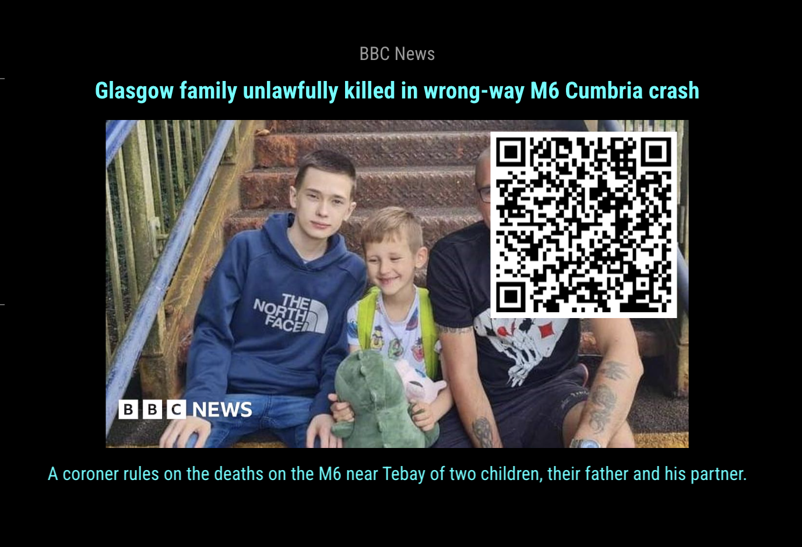

## MMM-EveryNews

* Over 30,000 News sources!
* Choose up to 10 at once.
* Simplified addition to your config entry.
* Now with QR code option to read full text article on your mobile device.

## Examples

, , , ,

## Installation

* `git clone https://github.com/themox/MMM-EveryNews` into the `~/MagicMirror/modules` directory.
* Get FREE API key --> https://newsapi.org/register
* Annotated .css file included for your convenience.

## Config.js entry and options
```
{
    disabled: false,
    module: 'MMM-EveryNews',
    position: 'bottom center',
    config: {
      source: 'bbc-news,cbs-news',                   // any source from https://newsapi.org/sources. // Up to 10 at once
      scroll: true,                                  // description scroll or static
      scrollSpeed: "3",                              // if scroll is true
      apiKey: 'YOUR API KEY GOES HERE',              // free API key from https://newsapi.org/register
      useHeader: true,                               // False if you don't want a header
      header: "Over 30,000 News Sources!",           // Any text you want. useHeader must be true
      maxWidth: "350px",
      animationSpeed: 3000,                          // fade speed
      rotateInterval: 5 * 60 * 1000,
      userAgent: "MagicMirror",                      // User-Agent for API requests in accordance with NewsAPI's requirements (can be customized to any valid UserAgent string; must not be blank)
      qrPosition: "top-left",                // Options: top-left, top-right, bottom-left, bottom-right
      useQr: false,                           // whether to use QR code or not; default is no.
      qrWidth: 120,                           // width, in px, of the QR code; recommend something like 120-150px, depending on your situation
    }
},
```

## For multiple News sources

* Separate sources by commas
* (Ex. 'bbc-news,national-geographic'). Any source from https://newsapi.org/sources
* Up to 10 at a time

## Sources

Open the "sources.json" file in a code editor (or text editor) and use the id's (as written) in your config entry. This is just a sample of the news sources available for this module. You can use any source from https://newsapi.org/sources.
Use up to 10 at a time.

Update 4/4/2025 - I added the ability to get a QR code for the news articles in case you see one and you want to read more of it.  Let me know if you'd like any other new features or find any bugs.
