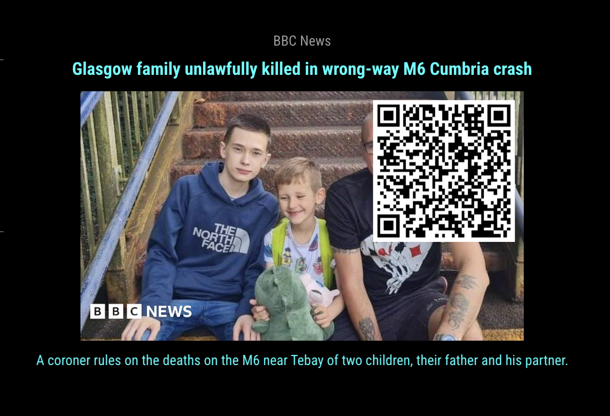

# MMM-EveryNews

* Over 30,000 News sources!
* Choose up to 10 at once.
* Simplified addition to your config entry.
* Now with QR code option to read full text article on your mobile device.

## Examples

<br/>
<br/>
<br/>


## Installation
1. To install the module, use your terminal to navigate to your MagicMirror²'s modules folder. If you are using the default installation directory, use the command:<br />`cd ~/MagicMirror/modules`
2. Clone the module:<br />`git clone https://github.com/themox/MMM-EveryNews`
3. Install required apis:<br />`npm newsapi --save`
4. Get FREE API key --> https://newsapi.org/register; add this to your config.js
5. Update your custom.css accordingly.  Annotated .css file included for your convenience.
* Important note: the free account has a maximum number of queries of 100 per day (Slightly more than 1x every 15 minutes).  If you are doing a lot of testing where you are restarting your MM, especially if you are not testing this module, recommend that you temporarily disable this module in so you don't get rate-limited.  If you do happen to get rate-limited, simply wait 24 hours and you'll be good to go again.  In regular operation you could easily do once every 12-24 hours and see no negative effects; in practice these news articles are not updating very frequently, and the free account has you getting all articles time-late by 24 hours anyway.

## Update Instructions

From the MagicMirror\modules\MMM-Oura2\ path:
1. Pull down the latest files from GitHub:<br/>`git pull` 
2. Remove the old npm files:<br/> `rm -rf node_modules package-lock.json`
3. Install new/updated apis:<br />`npm install`

## Config.js entry and options
```
{
    disabled: false,
    module: 'MMM-EveryNews',
    position: 'bottom center',
    config: {
      sources: ['bbc-news,cbs-news'],                // any source from https://newsapi.org/sources; up to 10 at once
      lang: 'en',                                    // see https://newsapi.org/ for supported languages; varies by source
      scroll: true,                                  // description scroll or static
      scrollSpeed: 3,                                // if scroll is true
      apiKey: 'YOUR API KEY GOES HERE',              // free API key from https://newsapi.org/register
      useHeader: true,                               // False if you don't want a header
      header: "Over 30,000 News Sources!",           // Any text you want. useHeader must be true
      maxWidth: "350px",
      animationSpeed: 3000,                          // fade speed
      initialLoadDelay: 4250,                        // time at initial start before attempting to get articles (ms)
      retryDelay: 2500,                              // on error, how long to wait before retrying (ms)
      rotateInterval: 5 * 60 * 1000,                 // time between rotate to next article (ms)
      updateInterval: 30 * 60 * 1000,                // time between updates (getting new articles from web) - recomend not smaller than this which is an update every 30 minutes (api sets daily max as 100 for free accounts)
      userAgent: "MagicMirror",                      // User-Agent for API requests in accordance with NewsAPI's requirements (can be customized to any valid UserAgent string; must not be blank)
      qrPosition: "top-left",                        // Options: top-left, top-right, bottom-left, bottom-right
      useQr: false,                                  // whether to use QR code or not; default is no.
      qrWidth: 120,                                  // width, in px, of the QR code; recommend something like 120-150px, depending on your situation
    }
},
```

| Option              | Details
|-------------------- |--------------
| `sources`           | *Required* - `String Array` of news sources from any of the valid ones at the [News API site](https://newsapi.org/docs/endpoints/sources)<br> Use the `id` field value for this.  e.g. `['bbc-news,cbs-news']`
| `lang`              | *Required* - `String`; What language?  Available languages are at the same link as above, but not all sources are available in all languages.<br> e.g. `en`
| `apiKey`            | *Required* - `String`; Your API key that you obtained free by [registering with NewsAPI](https://newsapi.org/register).
| `scroll`            | `Boolean`; Whether you want the content to scroll or not.  <br> **Default value:** `true`
| `scrollspeed`       | `Integer`; How fast you want the content to scroll (if scroll is true). <br> **Default value:** `3`
| `useHeader`         | `Boolean`; Do you want to display the header or not? <br> **Default value:** `true`
| `header`            | `String`; What the header should be if you use it. <br> **Default value:** `MMM-EveryNews`
| `maxWidth`          | `String`; Max width in this module on screen; should align with your CSS for best performance and this value should be CSS compliant.<br> **Default value:** `350px`
| `animationSpeed`    | `Integer`; fade speed for articles. <br> **Default value:** `3000`
| `initialLoadDelay`  | `Integer`; value in ms; If for some reason you want the MM to delay before first trying to get articles. <br> **Default value:** `4250`
| `retryDelay`        | `Integer`; value in ms; time to wait if the request errors out. <br>**Default value:** `2500`
| `rotateInterval`    |`Integer`; value in ms; how long to wait before rotating to the next article. <br>**Default value:** `40 * 1000` (40s)
| `updateInterval`    | `Integer`; value in ms; how long between sending a request to the NewsAPI to refresh articles. <br>**Default value:** `30 * 60 * 1000` (30 min)
| `userAgent`         | `String`; Current News API requires a non-null userAgent string for all requests. <br>**Default value:** `MagicMirror`
| `qrPosition`        | `String`; Where do you want the QR code to be displayed?  One of: [`top-left`, `top-right`, `bottom-left`, `bottom-right`]. <br>**Default value:** `top-left`
| `useQr`             | `Boolean`; Do you want the QR code to be displayed?  <br>**Default value:** `true`
| `qrWidth`           | `Integer`; Width (in pixels) for the qrCode; recommend something like 120-150px.  Too small will make it unreadable by your mobile device; too large will overwhelm the space available.  Height will be auto-set to same value.  <br>**Default value:** `120`

## For multiple News sources

* Separate sources by commas
* (Ex. 'bbc-news,national-geographic'). Any source from https://newsapi.org/sources
* Up to 10 at a time

## Sources

Open the "sources.json" file in a code editor (or text editor) and use the id's (as written) in your config entry. This is just a sample of the news sources available for this module. You can use any source from https://newsapi.org/sources.
Use up to 10 at a time.

Update 4/4/2025 - I added the ability to get a QR code for the news articles in case you see one and you want to read more of it.  Let me know if you'd like any other new features or find any bugs.

## Developer commands
- `node --run lint` - Run linting checks.
- `node --run lint:fix` - Fix automatically fixable linting errors.